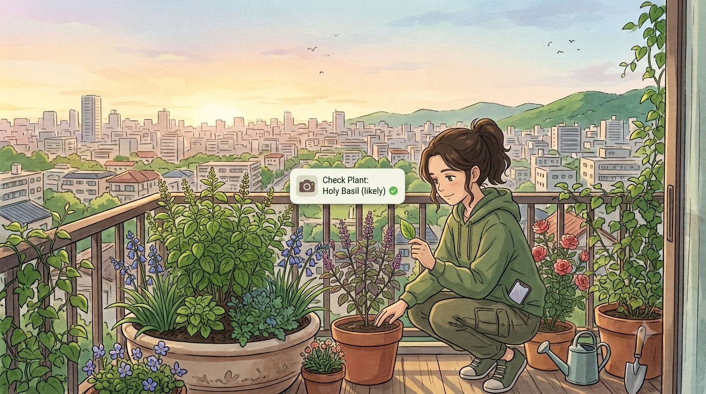

# 🌱 Petal & Leaf

> Touch the soil. Look at the leaf. Spot the flower. Phone back in your pocket.

Petal & Leaf gives you small daily quests for your plants (touch the soil,
check the leaves, listen for a bird), then helps you log what you found.
When available, the open Gemma 3 4B model runs locally through Ollama to
suggest quests, care tips, and photo observations. Built-in advice keeps working
when Ollama is unavailable.

Built for the DEV Hacktoberfest Open-Source AI Challenge: Week 1 (Touch Grass).

## App screenshots

| Check Plant | Quests |
| --- | --- |
|  |  |

### Nature log


## Gemma use cases

Petal & Leaf connects to the local `gemma3:4b` Ollama model for:

- **Plant photo checks:** suggest a likely plant, describe visible details,
  mention visible issues, and offer a photo-specific care tip. This is an AI
  guess, not a diagnosis.
- **Daily quest planning:** create three short, hands-on Tulsi quests using the
  selected soil state, season, and place.
- **Friendly seasonal care:** rephrase the current seasonal table tip in a
  welcoming voice.

Photo checks are optional. The app resizes photos before sending them to Ollama.
It does not identify birds.

## GitHub Copilot use cases

GitHub Copilot can help contributors extend this project by:

- Building and refining the React components and mobile-first styles.
- Explaining and updating the Ollama API integration and JSON response handling.
- Adding accessible UI states, local-first logging, and fallback behavior.
- Drafting focused tests and keeping the README and setup guidance current.

Copilot is a development aid; it is not required to run the app. Runtime AI
features use the configured local Ollama model.

## Why open-source AI?

- Plant care advice and quests have built-in fallbacks when Ollama is offline.
- With Ollama on the same computer, photos and prompts are sent to that local
  service rather than a hosted AI API.
- The model can be changed in the Ollama integration.

## Tech

React + Vite, Ollama with Gemma 3 4B, and browser local storage

## Run locally

```sh
npm install
npm run dev
```

Create a production build with `npm run build`.

## Local AI with Ollama

Petal & Leaf uses the locally installed `gemma3:4b` model through Ollama's API
at `http://localhost:11434`. Install and start Ollama, then download the model:

```sh
ollama pull gemma3:4b
ollama serve
```

In another terminal, run `npm run dev` and choose **Connect to local Gemma**.
If the browser blocks the request because of CORS, allow the local Vite origin
in Ollama's `OLLAMA_ORIGINS` setting (for example,
`http://localhost:5173,http://127.0.0.1:5173`) and restart Ollama. Petal & Leaf
continues to use built-in Tulsi care advice and quests when Ollama is unavailable.

### Using a phone on your Wi-Fi

Start Vite with `npm run dev -- --host 0.0.0.0`, then open
`http://<computer-LAN-IP>:5173` on the phone. Petal & Leaf sends Ollama requests
to port `11434` on the same host used for the app; `localhost` on the phone
would refer to the phone itself. Find the computer's LAN IP with `ipconfig`.

Ollama must listen on the LAN and allow the exact origin shown in the phone's
address bar. For example, in PowerShell, after quitting the Ollama tray app,
start it with:

```powershell
$env:OLLAMA_HOST = "0.0.0.0:11434"
$env:OLLAMA_ORIGINS = "http://192.168.1.25:5173"
ollama serve
```

Replace `192.168.1.25` with the computer's actual LAN IP. Keep this setup on a
trusted private network, and allow the Ollama port through Windows Firewall
only on the private network profile.

Nature log photos are resized to at most 800 pixels and stored as data URLs in
local storage with their entries. The screen/outside timer counts time while
Petal & Leaf is visible as screen time and hidden as outside time; session
summaries remain available while the app is open.

Nature log entries can also include a short written bird-listening note or an
optional recording of up to 10 seconds. Audio recordings are stored with the
entry in local storage; microphone access is requested only when recording.
